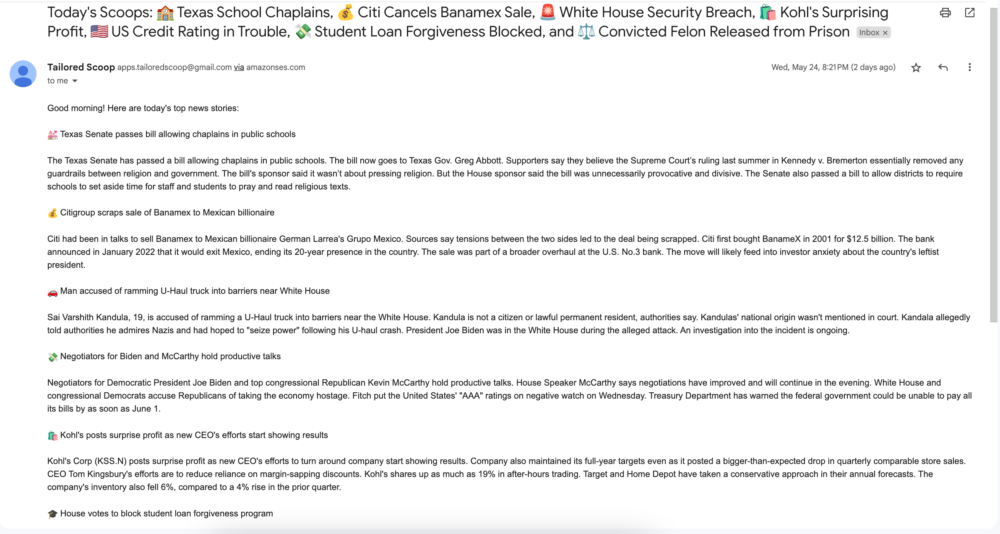

# tailoredscoop  

Automated customized daily news letter service.

https://tailoredscoops.com/

***

## Overview

This application creates daily newsletters curated using user's keywords. If no keywords are selected, the newsletter contains general top headlines. To retrieve most important and relevant stories, this service uses news APIs to get articles' URLs then scrapes each URL to get article texts. Then, huggingface text summarization models condense each article. And lastly, Open AI models are used to format the output into a nicely readable newsletter.

I'm using AWS Batch for serverless scheduled computing, which run Docker containerized services to create newsletters and AWS SES to send emails. Various news APIs such as NewsAPI and Google News RSS feeds are used to fetch stories. Text models include `facebook/bart-large-cnn` downloaded from huggingface and `gpt-3.5.turbo` and `gpt-4` from OpenAI. The frontend code for the webapp is built on Django and code can be found in the `apps.chansoos` repository. The backend uses two databases: `postgresql` and `mongodb`.

## Ongoing Challenges

Though there were initial challenges with hallucinations, this problem has mostly been solved. While the app no longer makes up stories (which though rare did happen at first), it does sometimes get some details wrong. As an example, it recently put in the headline that the Miami Heat were up 3-0 against the Boston Celtics, instead of 3-2. The story got it right, but the headline was wrong. This is something that remains to be solved. 

Scalability challenges depend on the distribution of keywords. If all users select the same keyword, only one newsletter needs to be generated each day. In the worst case, all users would request different keywords. A quick solution would be to restrict the number of available keywords by providing a list of options. 

## Example Email

